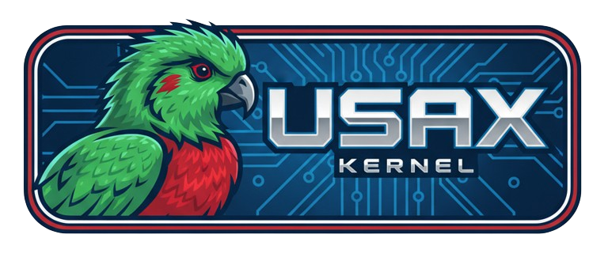

Qué \ Arquitectura         | i386                 | riscv64      | x86_64 (build)
--------------------|----------------------|--------------|------------------
Tests               | [](https://vkvaltchev.visualstudio.com/usax/_build/latest?definitionId=15&branchName=master) | [](https://dev.azure.com/vkvaltchev/usax/_build/latest?definitionId=14&branchName=master) | [](https://vkvaltchev.visualstudio.com/usax/_build/latest?definitionId=16&branchName=master)
Toolchain debian    | [](https://dev.azure.com/vkvaltchev/usax/_build/latest?definitionId=19&branchName=master) | [](https://dev.azure.com/vkvaltchev/usax/_build/latest?definitionId=20&branchName=master) | N/A
Toolchain fedora    | [](https://dev.azure.com/vkvaltchev/usax/_build/latest?definitionId=21&branchName=master) | [](https://dev.azure.com/vkvaltchev/usax/_build/latest?definitionId=22&branchName=master) | N/A
Toolchain archlinux | [](https://dev.azure.com/vkvaltchev/usax/_build/latest?definitionId=23&branchName=master) | [](https://dev.azure.com/vkvaltchev/usax/_build/latest?definitionId=24&branchName=master) | N/A
Toolchain openSUSE  | [](https://dev.azure.com/vkvaltchev/usax/_build/latest?definitionId=25&branchName=master) | [](https://dev.azure.com/vkvaltchev/usax/_build/latest?definitionId=26&branchName=master) | N/A

[](https://codecov.io/gh/vvaltchev/usax) [](https://opensource.org/licenses/BSD-2-Clause)

<a href="https://youtu.be/Ce1pMlZO_mI">
   
</a>

Contenido
----------------------------------------
* [Resumen](#resumen)
  - [¿Qué es usax?](#qué-es-usax)
    * [Planes futuros](#planes-futuros)
  - [¿Qué NO es usax?](#qué-no-es-usax)
    * [usax vs Linux](#usax-vs-linux)
* [Características](#características)
   - [Soporte i686](#soporte-i686)
   - [Soporte riscv64](#soporte-riscv64)
   - [Sistemas de archivos](#sistemas-de-archivos)
   - [Procesos y señales](#procesos-y-señales)
   - [E/S](#es)
   - [Consola](#consola)
   - [Aplicaciones en espacio de usuario](#aplicaciones-en-espacio-de-usuario)
* [Arrancar usax](#arrancar-usax)
  - [El cargador de arranque de usax](#el-cargador-de-arranque-de-usax)
  - [Cargadores de terceros](#cargadores-de-terceros)
    * [Soporte GRUB](#soporte-grub)
* [Documentación y HOWTOs](#documentación-y-howtos)
  - [Construir usax](#construir-usax)
  - [Probar usax](#probar-usax)
  - [Depurar usax](#depurar-usax)
    * [Panel de depuración de usax](#panel-de-depuración-de-usax)
* [Un comentario sobre la experiencia de usuario](#un-comentario-sobre-la-experiencia-de-usuario)
* [FAQ](#faq)

Resumen
----------------------------------------

<p align="center">
    
</p>

### ¿Qué es usax?
`usax` es un kernel monolítico educativo diseñado para ser compatible con Linux a
nivel binario. Actualmente funciona en i686 y RISCV64. El diseño pequeño y simple
del proyecto lo convierte en el patio de recreo perfecto para experimentar en modo
kernel mientras se mantiene la posibilidad de comparar cómo se ejecutan los mismos
bits de espacio de usuario en el kernel de Linux. ¡Eso es una característica rara!
Gracias a ello, compilar un programa para usax solo requiere una cadena de herramientas
`gcc-musl` de [bootlin.com](https://toolchains.bootlin.com). usax no necesita su propio
conjunto de aplicaciones escritas a medida; simplemente ejecuta programas estándar de
Linux como la suite **BusyBox**. Aunque la compatibilidad con Linux y el diseño monolítico
puedan parecer una limitación desde el punto de vista de la investigación de sistemas
operativos, por otro lado acercan el proyecto a aplicaciones del mundo real, comparado
con proyectos educativos que requieren un esfuerzo considerable para portar software
preexistente. Además, nada impide que usax implemente llamadas al sistema no-Linux que
aplicaciones conscientes puedan aprovechar.

#### Planes futuros
A largo plazo, `usax` podría hacerse popular en sistemas embebidos que requieran un
comportamiento totalmente determinista y latencias extremadamente bajas. Con algo de
suerte, usax podría cubrir el hueco entre *Embedded Linux* y sistemas operativos de
tiempo real como *FreeRTOS* o *Zephyr*. El kernel ya funciona en RISCV64 y en algún
momento será portado a la familia `ARM`. También podría adaptarse para CPUs sin MMU.
usax sería adecuado para estos casos porque consumir poca RAM ha sido siempre un
objetivo clave en su diseño: hoy en día el kernel puede iniciarse en una máquina QEMU
con solo 3 MB de memoria.

Además, añadir soporte básico para red y almacenamiento forma parte de los planes, aunque
no se han definido todos los detalles. El soporte de red podría limitarse inicialmente a
UDP + IP y a un conjunto reducido de tarjetas de red. Lo mismo para el almacenamiento: no
todas las clases de dispositivos de bloque serán soportadas y se implementarán pocos
sistemas de archivos (quizá solo FAT32 y ext2). Se considerará soporte FUSE.

Un hito importante será soportar red y almacenamiento para una SoC concreta como la
Raspberry Pi 3 (o 4), pero eso podrá ocurrir solo después de portar usax a ARM64.

### ¿Qué NO es usax?
 * Un intento de reescribir o reemplazar el kernel de Linux. usax es un kernel completamente
diferente que tiene compatibilidad parcial con Linux únicamente para aprovechar sus programas
y toolchains. Además, eso ayuda a validar su corrección: si un programa funciona en Linux,
debe funcionar igual en usax (salvo características no implementadas). Tener muchos programas
Linux funcionando en él es solo un punto de partida; con el tiempo usax evolucionará y tendrá
su propio conjunto de características únicas.

* Un kernel adecuado para un sistema operativo de escritorio. Ningún servidor X funciona en
usax hoy, no solo por la gran cantidad de características extra necesarias, sino porque
eso está fuera del objetivo del proyecto. Véase también: https://github.com/vvaltchev/usax/discussions/81

#### usax vs Linux
usax es fundamentalmente distinto de Linux ya que no pretende dirigirse a máquinas servidoras
multiusuario ni a escritorios. Linux no es complejo por una implementación pobre, sino por la
increíble cantidad de características que ofrece y la complejidad intrínseca que ello conlleva.
En otras palabras, Linux es excelente para el problema que resuelve. usax ofrecerá menos
características a cambio de:

 - código más simple (por mucho)
 - binario más pequeño
 - comportamiento extremadamente determinista
 - latencias ultra bajas
 - desarrollo y pruebas más sencillos
 - mayor robustez

En conclusión, aunque por ahora es un proyecto educativo, ha sido escrito con estos objetivos
en mente y cuenta con una infraestructura de pruebas que intenta ser casi de nivel empresarial
(ver [Testing](#probar-usax)).

Características
----------------------------------------

usax es un kernel monolítico preemptible tipo NIX, implementando unas ~100 llamadas al sistema
compatibles con Linux. En su núcleo, el kernel no es x86-céntrico aunque esa fue su primera
arquitectura objetivo. Casi todo el código del kernel no es específico de la arquitectura y
puede compilarse para cualquier arquitectura para ejecutarse como parte de las pruebas unitarias.

#### Soporte i686
Aunque el kernel usa bastante hardware heredado como los PICs 8259 para IRQs, el PIT 8254 para
el temporizador del sistema, el UART 16550 para comunicación serial, el controlador de teclado
8042, el DMA 8237 y la tarjeta de sonido Sound Blaster 16 (solo en QEMU), también soporta
características recientes como instrucciones FPU SSE/AVX/AVX2, PAT, sysenter i686, enumeración
PCI Express (via ECAM) y, sobre todo, soporte ACPI mediante ACPICA. ACPI se usa actualmente para
recibir eventos del botón de encendido, reiniciar o apagar la máquina y leer parámetros de las
baterías mediante métodos de control ACPI (cuando están implementados).

##### Ejecución en hardware x86 real
El sistema ha sido probado habitualmente en hardware real desde sus inicios, arrancándolo desde
una memoria USB (ver notas abajo). Máquinas de prueba incluyen i686 reales, x86_64 antiguas con
solo BIOS, x86_64 más nuevas con UEFI+CSM y máquinas recientes con UEFI puro. Durante mucho tiempo
la regla fue: si no puedes probarlo en hardware real, no lo implementes en usax. Solo recientemente
se relajó un poco esa regla para desarrollar SB16. Es posible que en el futuro algunos controladores
se desarrollen solo en máquinas virtuales, justificándose por el valor educativo y la reutilización
del código. Pero eso nunca será una práctica dominante. usax se diseña para funcionar en hardware real,
donde ocurren cosas extrañas; ser fiable ahí es crítico.

#### Soporte riscv64

El soporte de usax para riscv64 se centra en aplicaciones embebidas. usax corre en modo supervisor RV64
(Smode), usa tablas de páginas SV39 de tres niveles y soporta punto flotante en espacio de usuario.

##### Soporte de periféricos riscv64
La arquitectura riscv64 adopta un modelo de drivers basado en device tree y en usax toda la información
hardware se obtiene del device tree proveído por el cargador de arranque. Por tanto, el código del kernel
riscv no contiene descripciones a nivel de placa. El temporizador del sistema (ticks) invoca el monitor
SBI (openSBI) a través de la interfaz RISC-V SBI en lugar de implementar un driver en el kernel. El reloj
RTC del sistema está implementado usando un driver simple de RTC virtual goldfish, que funciona solo en QEMU.

usax en RISCV no implementa periféricos de PC típicos como teclados: para entrada/salida se usan puertos seriales
en su lugar (suficiente para muchas aplicaciones embebidas). Se ha implementado el driver UART ns16550. Para
gestionar arquitecturas de interrupciones anidadas de varios niveles, usax implementa un marco simplificado similar
a la idea de dominios IRQ de Linux. Se soportan los controladores INTC y PLIC más comunes.

##### Soporte de placas
usax en RISCV64 implementa un framework BSP simple, que puede gestionarse estableciendo la variable de entorno
`BOARD` para construir una imagen de la placa correspondiente. Actualmente, usax soporta la placa Sipeed licheerv-nano
y la placa virtual qemu-virt (por defecto). qemu-virt tiene el modo framebuffer activado por defecto; en licheerv-nano
el soporte de FB requiere parchear el bootloader suministrado por Sipeed.

#### Sistemas de archivos
usax tiene una implementación sencilla pero completa de `ramfs` (enlaces suaves y duros, agujeros en ficheros,
mapeo en memoria, etc.), una implementación mínima de `devfs`, soporte de solo lectura para FAT16 y **FAT32**
(usado para initrd) permitiendo mapeo en memoria, y una implementación de `sysfs` usada para exponer el namespace
ACPI, la lista de dispositivos PCI(e) y la configuración en tiempo de compilación de usax. Para trabajar con múltiples
sistemas de archivos a la vez, usax tiene una implementación simple de VFS. Nota: no hay soporte para dispositivos de
bloque todavía, así que todo reside en memoria.

#### Procesos y señales
Aunque internamente usax emplea el concepto de hilo, el multithreading no está expuesto a espacio de usuario (hay
hilos de kernel, por supuesto). `fork()` y `vfork()` están implementados y se usa copy-on-write para procesos forked.
`waitpid()` está totalmente implementado (implica grupos de procesos, etc.). El soporte POSIX de señales es parcial:
se admiten manejadores personalizados via `rt_sigaction()`, pero muchos flags SA_* no están soportados y los manejadores
no pueden interrumpirse entre sí todavía. `rt_sigprocmask()`, `sys_rt_sigpending()`, `sys_rt_sigsuspend()` funcionan,
así como señales especiales como SIGSTOP, SIGCONT y SIGCHLD. Consulte [syscalls] para más detalles.

Una característica interesante: a pesar de la ausencia de multi-hilo en espacio de usuario, usax tiene soporte completo
de TLS (thread-local storage) via `set_thread_area()`, porque `libmusl` lo requiere incluso para procesos de un solo hilo.

#### E/S
Además de las clásicas `read()` y `write()`, usax soporta I/O vectorizado vía `readv()` y `writev()`. También soporta E/S
no bloqueante, `select()` y `poll()`. Hasta ahora, ningún programa ha necesitado `epoll` :-)

#### Consola
usax tiene una consola que soporta más del 90% de las características de la consola de Linux. Funciona igual (con capas
de abstracción) tanto en modo texto como en modo framebuffer. El esfuerzo por implementar una consola tan potente se
emprendió para que **Vim** funcione bien en usax con resaltado sintáctico, etc. Aunque parezca poco tradicional en
desarrollo kernel, poder ejecutar Vim en un kernel simple demuestra que usax puede ejecutar correctamente programas
con un grado de complejidad razonable.

#### Aplicaciones en espacio de usuario
usax puede ejecutar muchas aplicaciones de consola como la suite **BusyBox**, **Vim**, **TinyCC**, **Micropython**, **Lua**
y aplicaciones de framebuffer como **fbDOOM** por diversión, aunque esto esté fuera del alcance del proyecto. Consulte
la [wiki del proyecto] para más información.

[syscalls]: docs/syscalls.md
[wiki del proyecto]: https://github.com/vvaltchev/usax/wiki

Arrancar usax en x86
----------------------------------------

### El cargador de arranque de usax
`usax` incluye un cargador interactivo que funciona tanto en BIOS legado como en sistemas UEFI. Permite elegir el modo de
vídeo, el fichero del kernel y editar la línea de comandos del kernel.


### Cargadores de terceros (x86)
`usax` puede ser cargado por cualquier cargador que soporte `multiboot 1.0`. Por ejemplo, el cargador integrado de QEMU
funciona perfectamente:

    qemu-system-i386 -kernel ./build/usax -initrd ./build/fatpart

De hecho, esa forma de arrancar se usa en las pruebas del sistema. Un atajo es:

    ./build/run_multiboot_qemu

#### Soporte GRUB
`usax` puede arrancarse fácilmente con GRUB. Edite `/etc/grub.d/40_custom` (o cree otro archivo) añadiendo una entrada como:

```
menuentry "usax" {
    multiboot <PATH-TO-usax-BUILD-DIR>/usax
    module --nounzip <PATH-TO-usax-BUILD-DIR>/fatpart
    boot
}
```
Después ejecute `update-grub` como root y reinicie.

Documentación y HOWTOs
--------------------------

La documentación principal está en `docs/`. La [wiki] contiene contenido adicional como capturas de pantalla. Aquí hay una
guía rápida para empezar.

### Construir usax
El proyecto soporta muchas configuraciones, pero construir con la configuración por defecto se resume en unos pocos pasos.
El único requisito real es un host Linux x86_64 o WSL.

Pasos:

* Entra en el directorio raíz del proyecto.
* Construye la toolchain (solo la primera vez): `./scripts/build_toolchain`
* Compila el kernel y prepara la imagen booteable: `make`

Tras eso habrá un archivo `usax.img` en el directorio `build`. La forma más fácil de probarlo es ejecutar:

    ./build/run_qemu

#### Ejecutarlo en hardware físico
La imagen `usax.img` es booteable en máquinas físicas (UEFI o legacy). Graba la imagen con `dd` en un USB y reinicia.

#### Otras configuraciones
Para más detalles sobre cómo construir y configurar usax, consulte la guía [building] en `docs/`.

[building]: docs/building.md

### Probar usax
usax tiene pruebas unitarias, pruebas de kernel, pruebas de sistema (usando la interfaz syscall) y pruebas interactivas
automatizadas (simulando entrada de usuario vía el monitor de QEMU). Todo está integrado con el sistema de build. Hay
soporte de cobertura de código y scripts para generar reportes HTML (ver [coverage]). También está integrado con Azure
Pipelines. Instrucciones básicas para ejecutar pruebas:

#### Ejecutar las pruebas de usax
Se requiere Python 3. Para self-tests y pruebas de sistema clásicas:

    <BUILD_DIR>/st/run_all_tests -c

Para las pruebas unitarias:

   * Instala googletest (una vez) con:
     `./scripts/build_toolchain -s build_gtest build_gmock`

   * Compila las pruebas unitarias: `make gtests`

   * Ejecútalas: `<BUILD_DIR>/gtests`

Para más detalles, vea [testing].

[testing]: docs/testing.md
[googletest]: https://github.com/google/googletest

### Depurar usax
Con el servidor GDB integrado de QEMU es posible depurar el kernel usax casi como si fuera un proceso normal.
Pasos básicos:

  - (Opcional) Prepara una build de depuración.

  - Ejecuta la VM: `./build/run_qemu` y quédate en el bootloader.

  - En otro terminal: `gdb ./build/usax_unstripped`.

  - En GDB: `target remote :1234` para conectar al servidor GDB de QEMU.

  - Pon breakpoints: `break kmain`.

  - Teclea `c` para continuar y, en el bootloader, presiona ENTER para arrancar.

usax incluye scripts GDB en `other/gdb_scripts` para mejorar la experiencia (listar tareas, handles, etc.). Consulte
`docs/debugging.md`.

#### Panel de depuración de usax


Depurar con GDB dentro de una VM es conveniente, pero en hardware real no hay GDB. Además, incluso en VM hay casos donde
no es práctico. Para esos casos se introdujo un panel de depuración dentro del kernel. Empezó como algo parecido a
Magic SysRq y evolucionó a una especie de TUI con información de depuración y capacidades de trazado para procesos de
usuario. En el futuro soportará características de depuración más completas. Para más información, consulte `docs/debugging.md`.

Un comentario sobre la experiencia de usuario
----------------------------------

usax se diferencia de muchos proyectos open source en que realmente cuida la experiencia del "usuario" (desarrollador).
No es el típico proyecto de bajo nivel difícil de construir; no exige instalar 200 cosas en el host. usax pretende ser
fácil de construir y probar incluso para desarrolladores sin experiencia. Tiene un script sofisticado para construir su
propia toolchain que funciona en las principales distribuciones Linux y un sistema de build basado en CMake. La build produce
una imagen lista para QEMU o para grabar en USB. También incluye scripts para ejecutar QEMU en varias configuraciones.

#### Motivación
La razón es ofrecer a usuarios y contribuidores una experiencia agradable, evitando frustraciones. También se busca no
asustar a estudiantes o desarrolladores junior: deberían poder compilar y ejecutar algo con poco esfuerzo y quizá querer
contribuir. Aunque partes del proyecto sean complejas, al menos construir y ejecutar pruebas debe ser sencillo.

[coverage]: docs/coverage.md

FAQ
---------------------

Aquí hay una lista de preguntas frecuentes. No es exhaustiva y puede cambiar. La lista completa está en la página Q & A en
las Discussions del repositorio.

- [¿Por qué usax no tiene la característica/abstracción XYZ como otros kernels?](https://github.com/vvaltchev/usax/discussions/83)

- [¿Puede usax usarse para construir otros proyectos encima?](https://github.com/vvaltchev/usax/discussions/185)

- [¿Por qué soporte FAT32?](https://github.com/vvaltchev/usax/discussions/85)

- [¿Por qué mantener montado el initrd?](https://github.com/vvaltchev/usax/discussions/86)

- [¿Por qué usar 3 espacios para la indentación?](https://github.com/vvaltchev/usax/discussions/88)

- [¿Por qué muchos mensajes de commit son tan cortos?](https://github.com/vvaltchev/usax/discussions/89)

- [¿Puede TCC compilar usax y auto-hospedarse?](https://github.com/vvaltchev/usax/discussions/93)
